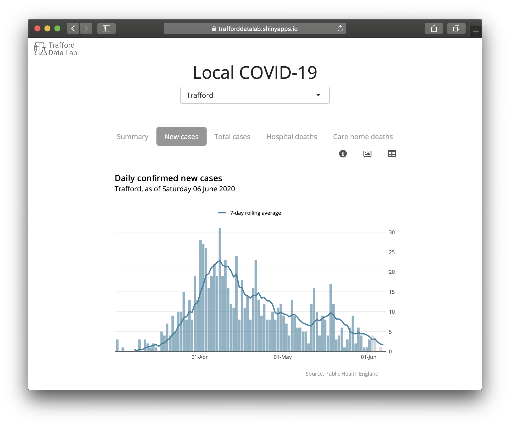

<h3>Local COVID-19</h3>
    
This tool visualises daily confirmed coronavirus cases and registered deaths in local authority districts in England. Further information about coronavirus (COVID-19) can be found at: <a href="https://www.gov.uk/coronavirus" target="_blank">gov.uk/coronavirus</a>

    
    
    
    <strong>Data sources</strong>
    <ul>
        <li><a href="https://coronavirus.data.gov.uk" target="_blank">Public Health England</a></li>
        <li><a href="https://www.ons.gov.uk/peoplepopulationandcommunity/healthandsocialcare/causesofdeath/datasets/deathregistrationsandoccurrencesbylocalauthorityandhealthboard" target="_blank">Office for National Statistics</a></li>
    </ul>
    <strong>Credits</strong>
    
This application was built by the <a href="https://www.trafforddatalab.io" target="_blank">Trafford Data Lab</a> in <a href="https://cran.r-project.org" target="_blank">R</a> using the <a href="https://cran.r-project.org/web/packages/shiny/index.html" target="_blank">shiny</a>  package.

